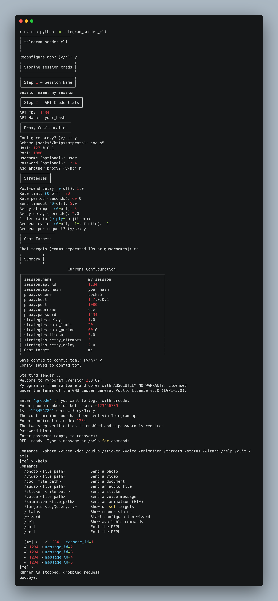

====================
telegram-sender-cli
====================

.. image:: https://img.shields.io/badge/python-3.14+-blue.svg
    :target: https://www.python.org/downloads/
.. image:: https://img.shields.io/badge/code%20style-ruff-000000.svg
    :target: https://github.com/astral-sh/ruff

A powerful, interactive command-line tool for sending messages and media via Telegram. Designed for broadcasting content to multiple targets with granular control over sending strategies.

Features
========

*   **Interactive REPL:** A feature-rich shell with autocompletion and command history.
*   **Multi-Target Broadcasting:** Send messages to multiple chat IDs, usernames, or links simultaneously.
*   **Rich Media Support:** Commands for sending photos, videos, documents, audio, stickers, voice messages, and animations.
*   **Granular Strategies:** Configurable rate limiting, retries (with jitter), delays, timeouts, and requeue.
*   **Interactive Wizard:** Step-by-step setup for API credentials, proxies, and default targets.
*   **Flexible Proxy Support:** Supports SOCKS5, HTTPS, and MTProto proxies.
*   **Modern Python:** Built using Python 3.14+, ``asyncio``, and ``prompt-toolkit``.

Installation
============

The project uses `uv <https://github.com/astral-sh/uv>`_ for dependency management.

.. code-block:: bash

    git clone https://github.com/mt-tg-stack/telegram-sender-cli.git
    cd telegram-sender-cli
    uv sync

Quick Start
===========

Run the application:

.. code-block:: bash

    uv run python -m telegram_sender_cli

On the first run, the interactive wizard will guide you through the configuration (API ID, API Hash, Proxy, etc.).

REPL Commands
=============

Once in the REPL, you can use the following commands:

*   ``/targets <id,@user,...>`` - Set or view current message targets.
*   ``/photo <file_path>`` - Send a photo.
*   ``/video <file_path>`` - Send a video.
*   ``/doc <file_path>`` - Send a document.
*   ``/wizard`` - Restart the configuration wizard.
*   ``/status`` - Show current runner status.
*   ``/help`` - Show all available commands.
*   ``/quit`` or ``/exit`` - Exit the application.

Configuration
=============

Configuration is stored in ``config.toml``. You can edit it manually or use the ``/wizard`` command within the REPL.

Example ``config.toml``:

.. code-block:: toml

    [session]
    name = "my_session"
    api_id = 12345
    api_hash = "your_api_hash"

    [strategies]
    delay = 1.0
    rate_limit = 20
    retry_attempts = 3

Development
===========

Linting and Formatting:

.. code-block:: bash

    uv run ruff check .
    uv run ruff format .

Type Checking:

.. code-block:: bash

    uv run mypy .

License
=======

This project is licensed under the MIT License.
